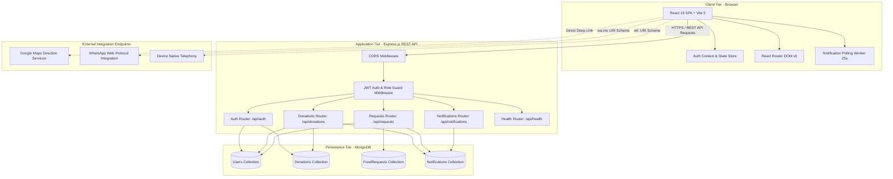
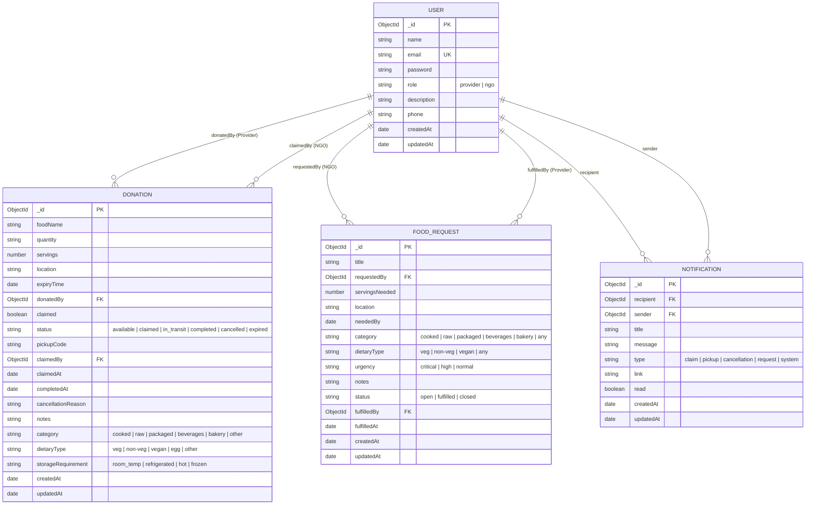
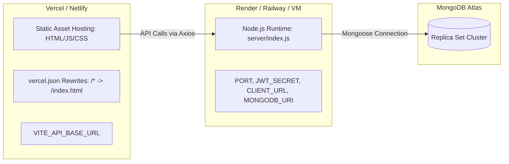

# High-Level Design (HLD) — FoodBridge 2.0
**Project Name:** FoodBridge 2.0  
**Document Type:** High-Level System Architecture & Design Specification  
**Target Assessment:** Technical Viva / System Validation / Architecture Review  
**Version:** 2.0.0  
**Status:** Implemented & Verified  

---

## 1. System Overview & Architecture Diagram

FoodBridge 2.0 is designed as a modular, client-server web application adhering to RESTful API principles and modern Single Page Application (SPA) architecture. It supports both **Decoupled Deployment** (Vercel Frontend + Render/Railway Backend) and **Monolithic Single-Service Deployment** (Express serving compiled static assets).



---

## 2. Technology Stack & Technical Rationale

| Layer | Technology | Version | Key Technical Rationale |
| :--- | :--- | :--- | :--- |
| **Frontend Framework** | React.js | `^18.3.1` | Component-based declarative UI, virtual DOM diffing, concurrent rendering capabilities, hook ecosystem. |
| **Build Tooling** | Vite | `^5.4.2` | Lightning-fast ES modules development server, optimized Rollup production bundling, Hot Module Replacement (HMR). |
| **Styling & Design System** | Tailwind CSS + PostCSS | `^3.4.1` | Utility-first responsive styling, custom design tokens (primary emerald/green palette, custom typography, micro-animations). |
| **Routing** | React Router DOM | `^6.22.0` | Client-side declarative routing with nested hierarchies and custom `RoleRoute` protection wrappers. |
| **Icons & Visuals** | Lucide React | `^0.344.0` | High-performance, tree-shakeable SVG icon set for clean data visualization and UI clarity. |
| **HTTP Client** | Axios | `^1.6.0` | Promise-based HTTP client with automatic JSON transforms, custom baseURL configuration, and default auth header attachment. |
| **Backend Runtime** | Node.js (ESM) | `v18+` | Native ECMAScript Modules (`import`/`export`), asynchronous non-blocking event-driven I/O model. |
| **Web Server Framework** | Express.js | `^4.18.0` | Fast, unopinionated, lightweight HTTP framework with rich middleware chaining. |
| **Database & ODM** | MongoDB + Mongoose | `^8.1.0` | Schema validation, strongly typed models, compound indexing, population joins, lifecycle pre-save hooks. |
| **Authentication & Crypto** | JSON Web Tokens + bcryptjs | `^9.0.0` / `^2.4.3` | Stateless authentication with signed claims and salt-hashed password protection ($10\text{ rounds}$). |
| **Environment Management** | dotenv | `^16.4.0` | 12-factor application design, isolating secrets from source control. |

---

## 3. Frontend Architecture

### 3.1 Routing & View Hierarchy

The application routing is organized in `App.jsx` under a unified `BrowserRouter`:

```
/ (HomePage)                           [Public]
├── /login (LoginPage)                 [Public - Redirects if authenticated]
├── /register (RegisterPage)           [Public - Redirects if authenticated]
├── /listings (FoodListingsPage)       [Public - Claim requires NGO auth]
├── /requests (FoodRequestsPage)       [Public - Post requires NGO, Fulfill requires Provider]
├── /donate (DonateFoodPage)           [Protected: RoleRoute role="provider"]
├── /provider-dashboard (ProviderDash) [Protected: RoleRoute role="provider"]
├── /dashboard (NGODashboard)          [Protected: RoleRoute role="ngo"]
└── * (Wildcard fallback)              [Redirects to /]
```

### 3.2 State Management & Auth Hydration
- **`AuthContext.jsx`**: Global authentication provider exposing:
  - `user`: Authenticated user profile object (`_id`, `name`, `email`, `role`, `phone`, `description`).
  - `token`: Active JWT string.
  - `loading`: Boolean state indicating auth hydration in progress.
  - `login(userData, jwtToken)`: Saves token to `localStorage` (`fb_token`) and configures `axios.defaults.headers.common['Authorization']`.
  - `logout()`: Purges `fb_token`, resets state, and clears Axios headers.
  - **Hydration Lifecycle:** On application mount, if `localStorage` contains `fb_token`, the app calls `GET /api/auth/me` to refresh user data or gracefully invalidates stale tokens.

### 3.3 Component Architecture
- **Navigation & Control (`Navbar.jsx`)**: Sticky header containing logo, role-sensitive navigation links, Profile trigger, Notification popover trigger, and mobile drawer.
- **Card Presenters (`FoodCard.jsx`)**: Reusable unit displaying dietary tags, categories, live expiry timer, portion counts, location summary, donor details, and modal trigger.
- **Timer Subsystem (`CountdownTimer.jsx`)**: Independent timer calculating remaining milliseconds, formatted dynamically into Hours, Minutes, and Seconds with color transitions.
- **Interactive Modals (`DonationDetailModal.jsx`, `ProfileModal.jsx`)**: Backdrop-blurred modal portals supporting deep linking (Google Maps, WhatsApp, Tel) and in-modal OTP verification.
- **Alert System (`NotificationCenter.jsx`)**: Popover with polling interval ($25\text{ s}$), badge count, and read/unread state mutation.

---

## 4. Backend Architecture

### 4.1 Request Processing Pipeline

```
Incoming HTTP Request
        │
        ▼
[cors Middleware] ───> Checks Origin vs allowedOrigins / .vercel.app / .onrender.com
        │
        ▼
[express.json()] ────> Parses application/json body
        │
        ▼
[Router Routing]
 ├── /api/auth           ───> auth.js
 ├── /api/donations      ───> donations.js
 ├── /api/notifications  ───> notifications.js
 ├── /api/requests       ───> requests.js
 └── /api/health         ───> Inline Health Check
        │
        ▼
[protectRoute Guard] ─> Validates Bearer JWT, sets req.user = { userId, role }
        │
        ▼
[requireRole Guard]  ─> Enforces 'provider' or 'ngo' access permissions
        │
        ▼
[Controller Handler] ───> Executes Mongoose operations & generates response
        │
        ▼
[Static Files / SPA] ───> Express serves ../dist and index.html for non-API GETs
```

### 4.2 Modular Route Structure
1. **`server/routes/auth.js`**: User registration, login, `/me` hydration, profile update, individual impact computation.
2. **`server/routes/donations.js`**: Public filtered queries, platform aggregate metrics, provider listing management, NGO claiming with OTP generation, handover verification, cancellation.
3. **`server/routes/requests.js`**: Community request queries, request creation, provider fulfillment pairing, request deletion.
4. **`server/routes/notifications.js`**: Notification listing, single read mutation, bulk read mutation.

---

## 5. Database Architecture & Data Models

The persistence layer uses **MongoDB** managed via **Mongoose 8 ODM**.



### 5.1 Indexing Strategy
- **`Donation`**:
  - `{ claimed: 1, expiryTime: 1 }` — High performance public marketplace filtering.
  - `{ status: 1, expiryTime: 1 }` — Fast query resolution for active vs expired listings.
  - `{ donatedBy: 1, status: 1 }` — Instant provider dashboard queries.
  - `{ claimedBy: 1, status: 1 }` — Fast retrieval of NGO active claims and completed histories.
- **`FoodRequest`**:
  - `{ status: 1, neededBy: 1 }` — Rapid sorting of open emergency broadcasts.
  - `{ requestedBy: 1 }` — NGO personal request tracking.
- **`Notification`**:
  - `{ recipient: 1, read: 1, createdAt: -1 }` — Optimized unread count calculation and chronological alert feed.

---

## 6. Authentication & Security Architecture

### 6.1 Authentication Flow
1. User provides credentials to `POST /api/auth/login`.
2. Backend searches user record by unique lowercase email.
3. `user.comparePassword(password)` executes `bcrypt.compare()` against the stored hash.
4. On match, `jwt.sign({ userId, role }, JWT_SECRET, { expiresIn: '7d' })` generates a signed token.
5. Client stores token in `localStorage` and injects `Authorization: Bearer <token>` in Axios headers.

### 6.2 Security Controls
- **Password Protection:** Strong 10-round salt hashing via `bcryptjs`. Password field stripped from all JSON serializations via custom `toJSON()` method.
- **API Guarding:** `protectRoute` middleware decodes and verifies JWT signatures on all restricted endpoints, rejecting malformed, expired, or missing tokens with HTTP 401.
- **Role Enforcement:** `requireRole(role)` restricts operations (e.g. only `provider` can create donations or verify OTPs; only `ngo` can claim donations or create food requests).
- **Ownership Verification:** Controllers verify `req.user.userId === document.owner` before allowing mutations or deletions.
- **CORS Protection:** Express CORS middleware allows localhost development origins (`5173`, `4173`), `CLIENT_URL` environment variables, and automated regex matching for `.vercel.app`, `.netlify.app`, and `.onrender.com`.

---

## 7. External Integrations Architecture

1. **Google Maps Integration:**
   - Universal URL scheme: `https://www.google.com/maps/search/?api=1&query=${encodeURIComponent(location)}`
   - Enables drivers to launch native turn-by-turn navigation directly from the donation card or modal.
2. **WhatsApp Direct Messaging Protocol:**
   - URI Scheme: `https://wa.me/${sanitizedPhoneNumber}?text=${encodeURIComponent(message)}`
   - Formats pre-filled coordination messages with food donation title for zero-friction chat between driver and donor.
3. **Telephony Protocol:**
   - Standard `tel:${phone}` link enabling one-tap calling on mobile devices.

---

## 8. Deployment & Infrastructure Architecture



- **Production Configuration:**
  - `vercel.json` provides client-side routing rewrites for single-page routing without 404s.
  - Backend environment variables configured for database connection strings and JWT secrets.
  - Express serves compiled frontend assets from `dist/` as a built-in fallback monolith if deployed to a single host.
