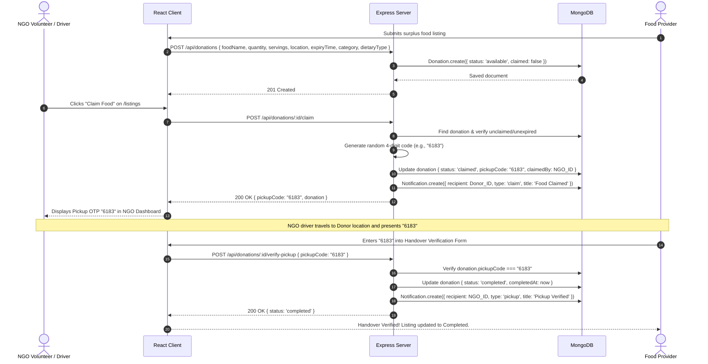

# Low-Level Design (LLD) — FoodBridge 2.0
**Project Name:** FoodBridge 2.0  
**Document Type:** Detailed Low-Level Component, Schema & Code-Level Specification  
**Target Assessment:** Technical Viva / Code Validation / Line-by-Line Architecture Review  
**Version:** 2.0.0  
**Status:** Implemented & Verified  

---

## 1. Directory Structure & File Map

```
foodbridge2.0/
├── dist/                          # Production build output
├── public/                        # Static public assets
├── server/                        # Backend Express.js application
│   ├── index.js                   # Main server entry, CORS, DB connection, static fallback
│   ├── middleware/
│   │   └── authMiddleware.js      # protectRoute and requireRole middlewares
│   ├── models/
│   │   ├── Donation.js            # Mongoose schema for food donations & OTP tracking
│   │   ├── FoodRequest.js         # Mongoose schema for NGO community food broadcasts
│   │   ├── Notification.js        # Mongoose schema for user in-app notifications
│   │   └── User.js                # Mongoose schema for accounts with bcrypt hashing
│   └── routes/
│       ├── auth.js                # Auth, register, login, profile, individual impact
│       ├── donations.js           # Donation CRUD, claim, 4-digit OTP verification, cancel, stats
│       ├── notifications.js       # In-app notifications fetch and mark as read
│       └── requests.js            # Community food requests CRUD and fulfillment
├── src/                           # Frontend React 18 application
│   ├── components/
│   │   ├── CountdownTimer.jsx     # Live second-by-second countdown with urgency color states
│   │   ├── DonationDetailModal.jsx# Full details modal with Google Maps, WhatsApp, and OTP verify
│   │   ├── FoodCard.jsx           # Surplus food card presentation with dietary & category badges
│   │   ├── Navbar.jsx             # Top sticky navbar with role routing, profile & notification triggers
│   │   ├── NotificationCenter.jsx # Real-time notification popover with 25s polling worker
│   │   └── ProfileModal.jsx       # User profile edit modal with personal community impact metrics
│   ├── context/
│   │   └── AuthContext.jsx        # Global AuthProvider, token persistence, Axios interceptors
│   ├── pages/
│   │   ├── DonateFoodPage.jsx     # Surplus food donation form with safety confirmation & donor listings
│   │   ├── FoodListingsPage.jsx   # Public marketplace with location/category/dietary/urgency filters
│   │   ├── FoodRequestsPage.jsx   # Urgent community food needs board & provider fulfillment
│   │   ├── HomePage.jsx           # Landing page with hero, live counters, 4-step workflow, safety pledge
│   │   ├── LoginPage.jsx          # Email/password authentication form with redirect guard
│   │   ├── NGODashboard.jsx       # NGO portal: active pickup OTPs, available food, claims history
│   │   ├── ProviderDashboard.jsx  # Provider portal: impact scorecard, fast OTP verify, donation filters
│   │   └── RegisterPage.jsx       # Registration for providers and NGOs with form validation
│   ├── App.jsx                    # Root component, BrowserRouter, RoleRoute guards, global routes
│   ├── index.css                  # Tailwind CSS root stylesheet with custom components and tokens
│   ├── main.jsx                   # React DOM root render entry point
│   └── vite-env.d.ts              # Vite client TypeScript reference declarations
├── .env.example                   # Sample environment configuration template
├── eslint.config.js               # ESLint 9+ flat configuration
├── HLD.md                         # High-Level Design document
├── index.html                     # HTML5 single page entry
├── LLD.md                         # Low-Level Design document (this file)
├── package.json                   # Project metadata, dependencies, and NPM scripts
├── postcss.config.js              # PostCSS plugins (Tailwind, Autoprefixer)
├── PRD.md                         # Product Requirements Document
├── README.md                      # Project documentation and quickstart guide
├── tailwind.config.js             # Tailwind CSS theme configuration (custom colors, fonts)
├── test_e2e.js                    # Automated 13-stage End-to-End API lifecycle test suite
├── tsconfig.app.json              # TypeScript client configuration
├── tsconfig.json                  # Root TypeScript configuration
├── tsconfig.node.json             # TypeScript node tooling configuration
└── vercel.json                    # Vercel deployment rewrites configuration
```

---

## 2. Detailed Database Schemas & Models

### 2.1 `User.js` (`server/models/User.js`)
Stores authenticated entities (Food Providers and Charitable NGOs).

| Field | Type | Rules & Validations | Default / Behavior |
| :--- | :--- | :--- | :--- |
| `_id` | `ObjectId` | Auto-generated primary key | Unique identifier |
| `name` | `String` | Required, trim, minlength: 2 | Organization or contact display name |
| `email` | `String` | Required, unique, lowercase, trim, regex validated | Account login identifier |
| `password` | `String` | Required, minlength: 6 | Hashed with bcrypt (salt rounds = 10) |
| `role` | `String` | Required, enum: `['provider', 'ngo']` | Determines access privileges |
| `description` | `String` | Optional, maxlength: 300 | Organization description / address details |
| `phone` | `String` | Optional, string | Contact telephone for drivers/donors |
| `createdAt` / `updatedAt`| `Date` | Managed by Mongoose `timestamps: true` | ISO timestamp |

**Mongoose Hooks & Methods:**
- `pre('save')`: Checks `this.isModified('password')`. If true, generates `bcrypt.genSalt(10)` and hashes password before persisting.
- `methods.comparePassword(plainText)`: Executes `bcrypt.compare(plainText, this.password)`.
- `methods.toJSON()`: Clones document and removes `password` before returning to JSON callers.

---

### 2.2 `Donation.js` (`server/models/Donation.js`)
Represents surplus food batches declared by Providers and claimed by NGOs.

| Field | Type | Rules & Validations | Default / Behavior |
| :--- | :--- | :--- | :--- |
| `_id` | `ObjectId` | Auto-generated primary key | Unique identifier |
| `foodName` | `String` | Required, trim, maxlength: 100 | Name of food item (e.g., "Vegetable Biryani") |
| `quantity` | `String` | Required, trim | Physical measurement (e.g., "4 trays (20 kg)") |
| `servings` | `Number` | Min: 1, default: 10 | Estimated portions for impact analytics |
| `location` | `String` | Required, trim | Pickup address / GPS reference |
| `expiryTime` | `Date` | Required, Date object | Threshold datetime after which food expires |
| `donatedBy` | `ObjectId` | Required, Ref: `'User'` | Provider who posted the donation |
| `claimed` | `Boolean` | Default: `false` | Quick index flag for availability |
| `status` | `String` | Enum: `['available', 'claimed', 'in_transit', 'completed', 'cancelled', 'expired']` | Default: `'available'` |
| `pickupCode` | `String` | Default: `null` | 4-digit numeric verification OTP (e.g. `"8392"`) |
| `claimedBy` | `ObjectId` | Ref: `'User'`, default: `null` | NGO that claimed the food |
| `claimedAt` | `Date` | Default: `null` | Datetime of claim operation |
| `completedAt` | `Date` | Default: `null` | Datetime of OTP verification / handover |
| `cancellationReason` | `String` | Default: `""` | Note explaining reason for cancellation |
| `notes` | `String` | Maxlength: 500, default: `""` | Handling, packaging, allergen details |
| `category` | `String` | Enum: `['cooked', 'raw', 'packaged', 'beverages', 'bakery', 'other']` | Default: `'cooked'` |
| `dietaryType` | `String` | Enum: `['veg', 'non-veg', 'vegan', 'egg', 'other']` | Default: `'veg'` |
| `storageRequirement`| `String` | Enum: `['room_temp', 'refrigerated', 'hot', 'frozen']` | Default: `'room_temp'` |
| `createdAt` / `updatedAt`| `Date` | Managed by Mongoose `timestamps: true` | ISO timestamp |

**Mongoose Hooks & Indexes:**
- `pre('save')`: Synchronizes boolean `claimed` flag based on `status`:
  ```javascript
  if (this.status === 'claimed' || this.status === 'completed' || this.status === 'in_transit') {
    this.claimed = true;
  } else if (this.status === 'available') {
    this.claimed = false;
  }
  ```
- **Indexes:**
  - `donationSchema.index({ claimed: 1, expiryTime: 1 })`
  - `donationSchema.index({ status: 1, expiryTime: 1 })`
  - `donationSchema.index({ donatedBy: 1, status: 1 })`
  - `donationSchema.index({ claimedBy: 1, status: 1 })`

---

### 2.3 `FoodRequest.js` (`server/models/FoodRequest.js`)
Enables NGOs to broadcast urgent food shortages to nearby Providers.

| Field | Type | Rules & Validations | Default / Behavior |
| :--- | :--- | :--- | :--- |
| `_id` | `ObjectId` | Auto-generated primary key | Unique identifier |
| `title` | `String` | Required, trim, maxlength: 120 | Request title / description |
| `requestedBy` | `ObjectId` | Required, Ref: `'User'` | NGO creator |
| `servingsNeeded` | `Number` | Required, min: 1 | Count of required meals |
| `location` | `String` | Required, trim | Delivery address / camp location |
| `neededBy` | `Date` | Required | Target deadline for food delivery |
| `category` | `String` | Enum: `['cooked', 'raw', 'packaged', 'beverages', 'bakery', 'any']` | Default: `'cooked'` |
| `dietaryType` | `String` | Enum: `['veg', 'non-veg', 'vegan', 'any']` | Default: `'veg'` |
| `urgency` | `String` | Enum: `['critical', 'high', 'normal']` | Default: `'high'` |
| `notes` | `String` | Maxlength: 500, default: `""` | Packaging / diet requirements |
| `status` | `String` | Enum: `['open', 'fulfilled', 'closed']` | Default: `'open'` |
| `fulfilledBy` | `ObjectId` | Ref: `'User'`, default: `null` | Provider who agreed to fulfill |
| `fulfilledAt` | `Date` | Default: `null` | Datetime when provider fulfilled |
| `createdAt` / `updatedAt`| `Date` | Managed by Mongoose `timestamps: true` | ISO timestamp |

**Indexes:**
- `foodRequestSchema.index({ status: 1, neededBy: 1 })`
- `foodRequestSchema.index({ requestedBy: 1 })`

---

### 2.4 `Notification.js` (`server/models/Notification.js`)
Tracks asynchronous alerts generated by system events.

| Field | Type | Rules & Validations | Default / Behavior |
| :--- | :--- | :--- | :--- |
| `_id` | `ObjectId` | Auto-generated primary key | Unique identifier |
| `recipient` | `ObjectId` | Required, Ref: `'User'` | Target user receiving the alert |
| `sender` | `ObjectId` | Ref: `'User'`, default: `null` | Triggering actor |
| `title` | `String` | Required, trim | Short alert headline |
| `message` | `String` | Required | Descriptive explanation |
| `type` | `String` | Enum: `['claim', 'pickup', 'cancellation', 'request', 'system']` | Default: `'system'` |
| `link` | `String` | Default: `""` | Optional client-side route (e.g. `"/dashboard"`) |
| `read` | `Boolean` | Default: `false` | Read status toggle |
| `createdAt` / `updatedAt`| `Date` | Managed by Mongoose `timestamps: true` | ISO timestamp |

**Indexes:**
- `notificationSchema.index({ recipient: 1, read: 1, createdAt: -1 })`

---

## 3. Backend Middleware & Route Specifications

### 3.1 Authentication Middleware (`server/middleware/authMiddleware.js`)

#### `protectRoute(req, res, next)`
- Reads `req.headers.authorization`.
- Validates prefix `"Bearer <token>"`. If missing $\rightarrow$ returns `401 { message: "No token provided. Please log in." }`.
- Executes `jwt.verify(token, process.env.JWT_SECRET)`.
- If valid $\rightarrow$ assigns `req.user = decoded` (containing `userId`, `role`) and calls `next()`.
- If invalid or expired $\rightarrow$ returns `401 { message: "Invalid or expired token. Please log in again." }`.

#### `requireRole(role)`
- Higher-order middleware factory.
- Evaluates `if (req.user?.role !== role)`.
- If mismatch $\rightarrow$ returns `403 { message: "Access denied. Only <role>s can perform this action." }`.
- If match $\rightarrow$ calls `next()`.

---

### 3.2 Authentication & Profile Endpoints (`server/routes/auth.js`)

| Method | Endpoint | Protection | Description & Request/Response Contract |
| :--- | :--- | :--- | :--- |
| `POST` | `/api/auth/register` | Public | **Body:** `{ name, email, password, role, phone?, description? }`<br>**Success (201):** `{ message, token, user }`<br>**Errors:** 400 (Missing fields / Validation), 409 (Email exists), 500 |
| `POST` | `/api/auth/login` | Public | **Body:** `{ email, password }`<br>**Success (200):** `{ message, token, user }`<br>**Errors:** 400 (Missing fields), 401 (Invalid credentials), 500 |
| `GET` | `/api/auth/me` | `protectRoute` | **Success (200):** `{ user }`<br>**Errors:** 401 (Auth failed), 404 (User not found), 500 |
| `PUT` | `/api/auth/profile` | `protectRoute` | **Body:** `{ name?, phone?, description? }`<br>**Success (200):** `{ message, user }`<br>**Errors:** 400 (Validation), 401, 404, 500 |
| `GET` | `/api/auth/impact` | `protectRoute` | Calculates live user impact.<br>**Provider Success (200):** `{ role: 'provider', totalDonations, completedDonations, activeDonations, totalMealsRescued, co2SavedKg }`<br>**NGO Success (200):** `{ role: 'ngo', totalClaims, completedClaims, activeClaims, totalMealsDistributed, co2SavedKg }` |

---

### 3.3 Donations Endpoints (`server/routes/donations.js`)

| Method | Endpoint | Protection | Description & Logic |
| :--- | :--- | :--- | :--- |
| `GET` | `/api/donations/stats/platform`| Public | Calculates aggregated metrics across DB (`totalMealsRescued`, `foodSavedKg`, `co2SavedKg`, `totalProviders`, `totalNGOs`, `activeDonations`, `citiesCount`). Includes safety baselines for fresh databases. |
| `GET` | `/api/donations` | Public | **Query Params:** `category`, `dietaryType`, `location` (regex), `maxHours`. Returns unexpired, unclaimed donations sorted by `expiryTime: 1`. |
| `GET` | `/api/donations/my` | `protectRoute`, `requireRole('provider')` | Returns all donations posted by `req.user.userId` sorted by `createdAt: -1`, populated with `claimedBy` details. |
| `GET` | `/api/donations/claimed` | `protectRoute`, `requireRole('ngo')` | Returns all donations claimed by `req.user.userId` sorted by `claimedAt: -1`, populated with `donatedBy` details. |
| `GET` | `/api/donations/:id` | Public | Fetches single donation by ID, populated with `donatedBy` and `claimedBy`. |
| `POST`| `/api/donations` | `protectRoute`, `requireRole('provider')` | **Body:** `{ foodName, quantity, servings?, location, expiryTime, category, dietaryType, storageRequirement, notes? }`. Creates donation with `status: 'available'`. |
| `PUT` | `/api/donations/:id` | `protectRoute`, `requireRole('provider')` | Updates donation fields. Enforces ownership (`donatedBy.toString() === req.user.userId`). |
| `DELETE`| `/api/donations/:id` | `protectRoute`, `requireRole('provider')` | Deletes donation. Disallows deletion if already claimed by NGO. |
| `POST`| `/api/donations/:id/claim` | `protectRoute`, `requireRole('ngo')` | **OTP Generation Algorithm:**<br>1. Checks `donation.claimed === false && new Date(expiryTime) > now`.<br>2. Generates `pickupCode = Math.floor(1000 + Math.random() * 9000).toString()`.<br>3. Updates `status = 'claimed'`, `claimed = true`, `claimedBy = req.user.userId`, `claimedAt = new Date()`.<br>4. Creates `Notification` for Provider.<br>5. Returns `{ message: "Donation claimed successfully!", pickupCode, donation }`. |
| `POST`| `/api/donations/:id/verify-pickup`| `protectRoute` | **OTP Verification Algorithm:**<br>1. Validates `req.body.pickupCode`.<br>2. Compares `donation.pickupCode === req.body.pickupCode.trim()`.<br>3. On match $\rightarrow$ sets `status = 'completed'`, `completedAt = new Date()`.<br>4. Creates `Notification` for NGO.<br>5. Returns `{ message: "Pickup verified successfully! Handover complete.", donation }`. |
| `POST`| `/api/donations/:id/cancel`| `protectRoute` | Resets claim if called by claiming NGO (reverts to `status: 'available'`, `claimed: false`, `pickupCode: null`), or cancels donation if called by Provider. |

---

### 3.4 Food Requests Endpoints (`server/routes/requests.js`)

| Method | Endpoint | Protection | Description & Logic |
| :--- | :--- | :--- | :--- |
| `GET` | `/api/requests` | Public | **Query Params:** `category`, `dietaryType`, `location`. Returns open, unexpired requests sorted by `neededBy: 1`, populated with `requestedBy`. |
| `GET` | `/api/requests/my` | `protectRoute`, `requireRole('ngo')` | Returns requests created by `req.user.userId`. |
| `POST` | `/api/requests` | `protectRoute`, `requireRole('ngo')` | **Body:** `{ title, servingsNeeded, location, neededBy, category, dietaryType, urgency, notes }`. Creates request with `status: 'open'`. |
| `POST` | `/api/requests/:id/fulfill` | `protectRoute`, `requireRole('provider')` | Assigns `status: 'fulfilled'`, `fulfilledBy: req.user.userId`, `fulfilledAt: new Date()`. Emits notification to requesting NGO. |
| `DELETE`| `/api/requests/:id` | `protectRoute`, `requireRole('ngo')` | Removes open request (enforces `requestedBy` ownership). |

---

### 3.5 Notifications Endpoints (`server/routes/notifications.js`)

| Method | Endpoint | Protection | Description & Logic |
| :--- | :--- | :--- | :--- |
| `GET` | `/api/notifications` | `protectRoute` | Retrieves latest 30 notifications for `req.user.userId` sorted by `createdAt: -1` and unread count via `countDocuments({ recipient, read: false })`. |
| `PUT` | `/api/notifications/:id/read`| `protectRoute` | Updates single notification `{ read: true }`. |
| `PUT` | `/api/notifications/read-all`| `protectRoute` | Bulk updates all notifications for `req.user.userId` to `{ read: true }`. |

---

## 4. Frontend Component & Page Specifications

### 4.1 `AuthContext.jsx` (`src/context/AuthContext.jsx`)
- **State Properties:**
  - `user`: User profile or `null`.
  - `token`: Stored JWT or `null`.
  - `loading`: Initial hydration state flag.
- **Methods:**
  - `login(userData, jwtToken)`: Saves `jwtToken` to `localStorage` as `'fb_token'`, sets state, sets default Axios authorization header.
  - `logout()`: Clears `'fb_token'`, resets `user` and `token` state, deletes `axios.defaults.headers.common['Authorization']`.
  - `useAuth()`: Hook verifying context existence and returning auth store.

### 4.2 `CountdownTimer.jsx` (`src/components/CountdownTimer.jsx`)
- **Props:** `expiryTime` (`String` | `Date`), `compact` (`Boolean`, default: `false`).
- **Internal Logic:** Memoized `calculateTimeLeft` calculating difference $\Delta t = \text{expiryTime} - \text{now}$.
  - Computes `hours`, `minutes`, `seconds`.
  - Determines flags: `expired` ($\Delta t \le 0$), `urgent` ($\text{hours} < 2$), `warning` ($\text{hours} < 6$).
- **Lifecycle:** `useEffect` sets interval tick every $1,000\text{ ms}$ with automatic cleanup on unmount or `expiryTime` change.

### 4.3 `DonationDetailModal.jsx` (`src/components/DonationDetailModal.jsx`)
- **Props:** `donation`, `onClose`, `onClaim`, `onRefresh`, `isClaiming`.
- **Integrations:**
  - **Google Maps:** Generates search URL for pickup location.
  - **WhatsApp Link:** Formats `https://wa.me/91XXXXXXXXXX?text=...` using sanitized donor phone.
  - **Direct Calling:** Formats `tel:${donor.phone}`.
- **In-Modal Handover Verification:** Form providing input for 4-digit OTP, dispatching `POST /api/donations/:id/verify-pickup`.
- **Claim Cancellation:** Triggers `POST /api/donations/:id/cancel` with reason metadata.

### 4.4 `NotificationCenter.jsx` (`src/components/NotificationCenter.jsx`)
- **Props:** None (accesses `useAuth()`).
- **State:** `open` (dropdown visibility), `notifications` (array), `unreadCount` (number), `popoverRef`.
- **Lifecycle:** Fetches alerts on mount; runs recurring polling worker every $25,000\text{ ms}$; listens to document `mousedown` to close on click-outside.
- **Actions:** Individual `markAsRead(id)`, bulk `markAllAsRead()`.

### 4.5 `ProviderDashboard.jsx` (`src/pages/ProviderDashboard.jsx`)
- **Tabs:** `all` ("All Listings"), `active` ("Active & Available"), `claimed` ("Claimed Pending Pickup"), `completed` ("Completed History").
- **Quick Handover Verification Box:** Allows fast OTP entry by selecting any active claimed donation from a dropdown and verifying with 1 click.
- **Scorecard Metrics:** Renders Total Meals Rescued, CO2 Prevented, Active Listings, and Partner NGOs.

### 4.6 `NGODashboard.jsx` (`src/pages/NGODashboard.jsx`)
- **Tabs:** `active_pickups` ("Active Pickups (OTPs)"), `available` ("Available Food"), `claimed_history` ("My Claims History").
- **OTP Presentation Display:** Large, high-visibility 4-digit OTP card for volunteer drivers.
- **Direct Claim Cancellation:** Allows releasing a claim so other charities can rescue the food.

---

## 5. End-to-End Data Flows

### 5.1 Food Donation Claim & 4-Digit OTP Verification Flow



---

## 6. Automated E2E Test Suite Specification (`test_e2e.js`)

The repository includes a comprehensive 13-stage integration test suite validating every core API route and lifecycle flow:

```
🧪 Starting FoodBridge 2.0 API & Lifecycle Test Suite...

✅ 1. Health Check               → Verifies GET /api/health returns status: 'ok'
✅ 2. Platform Stats             → Verifies GET /api/donations/stats/platform aggregates correctly
✅ 3. Register Provider          → Verifies POST /api/auth/register creates provider & returns JWT
✅ 4. Register NGO               → Verifies POST /api/auth/register creates NGO & returns JWT
✅ 5. Update Profile             → Verifies PUT /api/auth/profile updates organization info
✅ 6. Post Donation              → Verifies POST /api/donations creates surplus listing
✅ 7. Filtered Public Listings   → Verifies GET /api/donations?category=cooked&dietaryType=veg
✅ 8. NGO Claims Donation (OTP)  → Verifies POST /api/donations/:id/claim returns 4-digit pickup OTP
✅ 9. Provider Notifications     → Verifies GET /api/notifications receives claim alert
✅ 10. Handover Verified (OTP)   → Verifies POST /api/donations/:id/verify-pickup completes handover
✅ 11. Individual Impact Stats   → Verifies GET /api/auth/impact calculates personal metrics
✅ 12. Community Request Flow    → Verifies POST /api/requests broadcasts urgent food requirement
✅ 13. Provider Fulfills Request → Verifies POST /api/requests/:id/fulfill matches and alerts NGO

🎉 ALL 13 END-TO-END TESTS PASSED SUCCESSFULLY! 🚀
```
