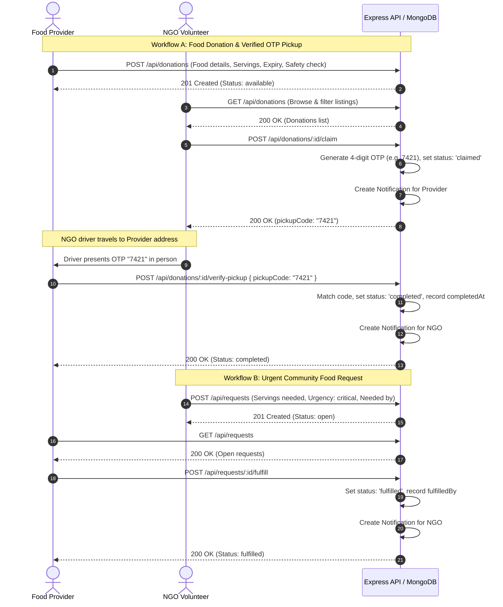

# Product Requirements Document (PRD) — FoodBridge 2.0
**Project Name:** FoodBridge 2.0  
**Domain:** Smart Surplus Food Rescue & Community Redistribution Network  
**Target Assessment:** Technical Viva / System Validation / Production Deployment  
**Version:** 2.0.0  
**Status:** Implemented & Verified  

---

## 1. Executive Summary & Problem Statement

### 1.1 The Problem
Commercial food establishments (restaurants, event caterers, hostel mess halls, corporate canteens, banquet halls) generate significant surplus edible food on a daily basis. Concurrently, charitable organizations (NGOs, orphanages, homeless shelters, community kitchens) face resource constraints in sourcing fresh, nutritious meals. 
Traditional food donation processes suffer from:
1. **Lack of Real-Time Coordination:** Perishable food spoils within hours due to communication delays.
2. **Safety and Verification Gaps:** Uncertainty regarding food storage conditions, dietary classifications, and lack of proof-of-handover leading to dispute or no-shows.
3. **Logistical Friction:** Drivers lack exact pickup locations, direct donor contact channels, and instant fulfillment routing.
4. **No Transparent Metric Tracking:** Providers and NGOs cannot quantify their environmental (CO2e) and social (meals fed) impact.

### 1.2 The Solution: FoodBridge 2.0
FoodBridge 2.0 is a full-stack, real-time surplus food redistribution platform designed to bridge commercial food donors and verified charitable institutions. Built with automated 4-digit One-Time-Password (OTP) handovers, second-by-second countdown timers, granular dietary and safety metadata, bidirectional community requests, and personal/platform impact analytics.

---

## 2. Target Users & Stakeholder Personas

| User Role | Description | Primary Goals & Workflows |
| :--- | :--- | :--- |
| **Food Provider (`provider`)** | Restaurants, hotels, caterers, university/hostel canteens, corporate cafeterias. | • Post surplus food batches with portion counts, pickup deadlines, storage guidelines, and hygiene confirmations. • Track listing lifecycle (Available $\rightarrow$ Claimed $\rightarrow$ Completed). • Verify NGO driver handovers using secure 4-digit OTP. • Fulfill urgent community food broadcasts from NGOs. • Monitor organization impact metrics (Meals Saved, CO2e Prevented). |
| **Charity / Shelter (`ngo`)** | Registered NGOs, orphanages, old-age homes, disaster relief camps, community feeding shelters. | • Discover live surplus food listings filtered by location, category, dietary preference, and urgency. • Claim donations instantly and receive a 4-digit pickup OTP. • Coordinate driver logistics via integrated Google Maps, WhatsApp, and phone links. • Broadcast urgent meal requirements with required servings and target times. • View claim history and individual community distribution metrics. |
| **Public / Visitor (`guest`)** | Unregistered users, volunteers, prospective partners, platform assessors. | • Browse real-time available food feed. • View platform impact statistics (Total Meals Rescued, CO2 Emissions Prevented, Active Providers/NGOs). • View food safety protocols and learn end-to-end workflow. • Register as a Provider or NGO. |

---

## 3. Core Functional Requirements

### 3.1 Authentication & Role-Based Access Control (RBAC)
- **FR-AUTH-01:** System shall support user registration with name, unique email, password (min 6 chars, hashed via bcrypt), role selection (`provider` or `ngo`), optional phone number, and optional organization description.
- **FR-AUTH-02:** System shall support email/password login, issuing a signed JSON Web Token (JWT) with a 7-day expiration.
- **FR-AUTH-03:** Client application shall persist auth state in `localStorage` (`fb_token`) and automatically hydrate user state via `/api/auth/me`.
- **FR-AUTH-04:** Protected routes (`RoleRoute`) shall restrict access based on user role (e.g., `/donate` and `/provider-dashboard` for `provider`; `/dashboard` for `ngo`). Unauthenticated users attempting to access protected routes shall be redirected to `/login`.
- **FR-AUTH-05:** Users shall be able to update their display name, phone number, and description through an in-app Profile Modal (`PUT /api/auth/profile`).

### 3.2 Food Donation Lifecycle Management
- **FR-DON-01:** Providers shall be able to post food donations specifying:
  - Food name (max 100 characters)
  - Physical quantity (e.g., "4 trays (20 kg)")
  - Estimated servings/portions (integer $\ge 1$, default 10)
  - Pickup location address
  - Expiry date and time (must be a valid future datetime)
  - Food Category: `cooked`, `raw`, `packaged`, `beverages`, `bakery`, `other`
  - Dietary Type: `veg` (Vegetarian), `non-veg` (Non-Vegetarian), `vegan` (Vegan), `egg` (Egg Containing), `other`
  - Storage Requirement: `room_temp` (Ambient), `hot` (Warm $>60^\circ\text{C}$), `refrigerated` ($<4^\circ\text{C}$), `frozen` ($<-18^\circ\text{C}$)
  - Handling notes (max 500 characters)
  - Mandatory food safety & hygiene confirmation checkbox
- **FR-DON-02:** System shall provide a public listings directory (`/listings`) supporting multi-parameter filtering:
  - Location search (case-insensitive substring match)
  - Category selection
  - Dietary type selection
  - Urgency timeframe (`maxHours`: $<2$ hrs, $<6$ hrs, $<24$ hrs)
- **FR-DON-03:** System shall automatically filter out expired donations from the public feed unless specifically queried.
- **FR-DON-04:** Providers shall be able to view all their posted donations and delete available unclaimed donations.

### 3.3 Secure 4-Digit Handover Verification (OTP Protocol)
- **FR-OTP-01:** When an authenticated NGO claims an available donation (`POST /api/donations/:id/claim`):
  - System shall verify the donation is unclaimed and unexpired.
  - System shall generate a random 4-digit numeric verification code (e.g., `"4829"`).
  - System shall update donation `status` to `'claimed'`, set `claimed: true`, record `claimedBy` and `claimedAt`.
  - System shall return the `pickupCode` exclusively to the claiming NGO.
  - System shall emit an in-app notification to the donating provider.
- **FR-OTP-02:** When the NGO driver arrives at the provider location, the provider verifies pickup (`POST /api/donations/:id/verify-pickup`):
  - Provider inputs the 4-digit code presented by the driver.
  - System verifies matching code against the recorded `pickupCode`.
  - Upon match, system updates `status` to `'completed'` and records `completedAt`.
  - System sends a completion notification to the NGO.
- **FR-OTP-03:** Either provider or claiming NGO shall be able to cancel an active claim (`POST /api/donations/:id/cancel`). If cancelled by NGO, the donation reverts to `status: 'available'`, `claimed: false`, and `pickupCode: null`.

### 3.4 Urgent Community Food Requests
- **FR-REQ-01:** Authenticated NGOs shall be able to broadcast urgent food needs (`POST /api/requests`):
  - Request title (max 120 characters)
  - Required servings count ($\ge 1$)
  - Delivery/Shelter location
  - Needed-by deadline (future datetime)
  - Category and dietary classification
  - Urgency level (`critical`, `high`, `normal`)
  - Notes for donors
- **FR-REQ-02:** Public directory (`/requests`) shall display open unexpired requests sorted by urgency and deadline.
- **FR-REQ-03:** Authenticated Providers shall be able to accept/fulfill any open request with a single click (`POST /api/requests/:id/fulfill`). Fulfilling updates request status to `'fulfilled'`, records `fulfilledBy` and `fulfilledAt`, and triggers an alert to the NGO.
- **FR-REQ-04:** The requesting NGO shall have authority to close/delete their request (`DELETE /api/requests/:id`).

### 3.5 Real-Time Expiry & Urgency Engine
- **FR-TIME-01:** Client UI shall calculate time remaining down to the second using localized client timers (`CountdownTimer.jsx`).
- **FR-TIME-02:** System shall render visual urgency indicators:
  - **Critical Alert (`urgent`):** $< 2$ hours remaining (pulsing red badge).
  - **Warning Alert (`warning`):** $< 6$ hours remaining (amber badge).
  - **Standard (`normal`):** $\ge 6$ hours remaining (emerald badge).
  - **Expired:** 0 seconds remaining (red expired badge).

### 3.6 In-App Notifications
- **FR-NOTIF-01:** System shall record notification events for:
  - Donation Claimed (alerts Donor)
  - Handover Verified (alerts NGO)
  - Claim/Donation Cancelled (alerts counterparty)
  - Food Request Fulfilled (alerts NGO)
  - System notices
- **FR-NOTIF-02:** Client navbar shall feature a real-time Notification Popover polling every 25 seconds, displaying unread counter badge, human-readable relative time ("5m ago"), and deep navigation links.
- **FR-NOTIF-03:** Users shall be able to mark individual notifications as read or mark all as read with one click.

### 3.7 Platform & Individual Impact Metrics
- **FR-METRIC-01:** Platform Statistics Engine (`GET /api/donations/stats/platform`):
  - Total Meals Rescued: sum of servings from completed/claimed donations (baseline calibrated to 1,250+).
  - Food Saved (kg): calculated as $\text{Meals} \times 0.45\text{ kg/meal}$.
  - CO2e Emissions Prevented (kg): calculated as $\text{Meals} \times 0.8\text{ kg CO}_2\text{e/meal}$.
  - Total Verified Providers & Total Partner NGOs.
- **FR-METRIC-02:** Individual Impact Engine (`GET /api/auth/impact`):
  - Provider: Total Donations, Active Donations, Completed Donations, Total Meals Rescued, Personal CO2 Saved (kg).
  - NGO: Total Claims, Active Pickups, Completed Pickups, Total Meals Distributed, Personal CO2 Saved (kg).

---

## 4. Non-Functional Requirements (NFR)

| Category | Requirement Specification |
| :--- | :--- |
| **Performance** | API response latency $< 200\text{ ms}$ under normal conditions. Database indexes on `{ claimed: 1, expiryTime: 1 }`, `{ status: 1, expiryTime: 1 }`, `{ recipient: 1, read: 1 }`. Production bundle gzip size $< 100\text{ kB}$ JS / $< 8\text{ kB}$ CSS. |
| **Security** | Passwords hashed using bcrypt with salt rounds $= 10$. JWT signed with HS256 secret. MongoDB injection prevention via Mongoose schema casting. Cross-Origin Resource Sharing (CORS) whitelist with permissive fallback. Protected API endpoints enforcing Bearer token verification. |
| **Reliability** | Fail-safe defaults on platform metrics so new environments render meaningful data. Graceful error handling in Axios callers and Express controllers. Single Page Application (SPA) fallback routing. |
| **Maintainability** | Clean modular architecture separating routes, models, middleware, pages, and components. ESLint 9+ flat configuration with Zero errors/warnings. TypeScript compilation check passing (`tsc --noEmit`). |
| **Usability & UX** | Fully responsive layout across mobile, tablet, and desktop viewports using Tailwind CSS. Accessible interactive elements with descriptive aria labels, clear visual feedback (loading spinners, toast alerts, confirmation dialogs). |

---

## 5. End-to-End User Workflows

---

## 6. Success Metrics & Key Performance Indicators (KPIs)

1. **Zero-Waste Efficiency:** Transition time from donation creation to claim $< 45$ minutes.
2. **Handover Integrity:** 100% of completed pickups validated via the 4-digit OTP protocol with zero unverified status bypasses.
3. **Platform Impact:** Real-time visibility into total meals rescued and kilograms of CO2e emissions prevented.
4. **Code Quality & Reliability:** 0 ESLint errors, 0 TypeScript errors, 13/13 passing automated E2E lifecycle tests.
